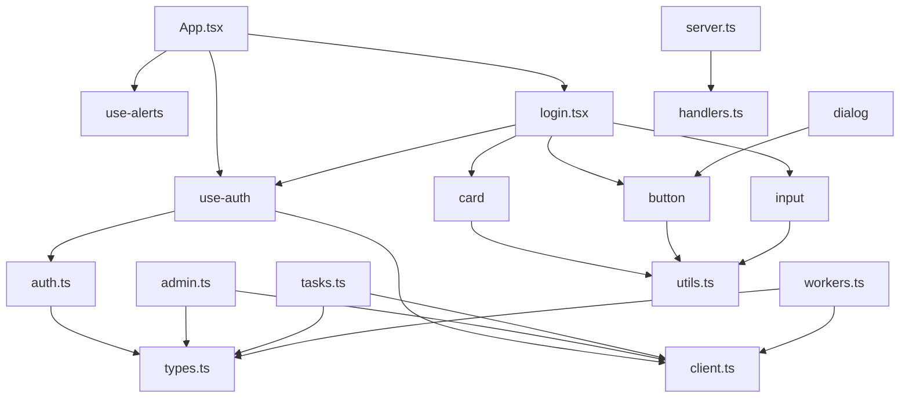

# Architecture Diagram: ADA

# Architecture Overview: ADA Web Dashboard

The `ADA` repository contains a React-based web dashboard designed for monitoring and managing system tasks, workers, and administrative functions. The architecture follows a modular pattern, separating UI components, API communication layers, and state management hooks.

## Architectural Layers

1.  **Application Entry (`App.tsx`)**: The root component that orchestrates global state (authentication, alerts) and routing to pages.
2.  **Pages**: High-level views (e.g., `login.tsx`) that compose UI components and utilize custom hooks to interact with the system.
3.  **Hooks**: Logic-heavy modules (e.g., `use-auth.tsx`, `use-alerts.tsx`) that bridge the gap between the UI and the API layer.
4.  **API Layer**: A structured set of services (`admin.ts`, `auth.ts`, `tasks.ts`, `workers.ts`) that communicate with the backend via a centralized `client.ts`.
5.  **UI Components**: A library of reusable, atomic components (buttons, cards, inputs) built upon `lib/utils.ts`.
6.  **Test Mocks**: A dedicated layer using MSW (Mock Service Worker) to simulate backend responses for integration and unit testing.

## Dependency Graph

## Key Modules

*   **`web-dashboard/src/api/`**: Contains the data access layer. By centralizing requests in `client.ts` and defining shared interfaces in `types.ts`, the application ensures consistent communication with the backend.
*   **`web-dashboard/src/components/ui/`**: A collection of presentational components. Most components depend on `lib/utils.ts` for class name merging and styling consistency.
*   **`web-dashboard/src/hooks/`**: Encapsulates side effects and business logic. `use-auth.tsx` is the primary hook for managing user sessions and API authorization.
*   **`web-dashboard/src/test-mocks/`**: Provides a robust testing foundation, allowing the dashboard to be developed and tested in isolation from the actual backend infrastructure.