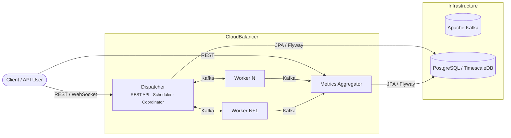
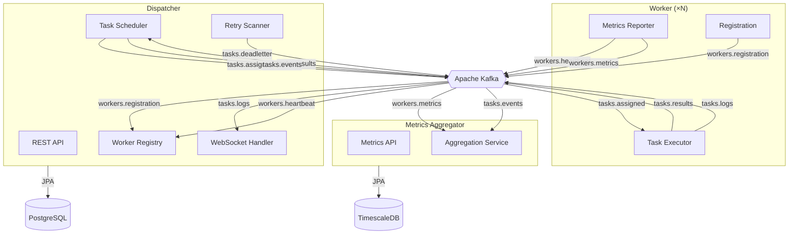
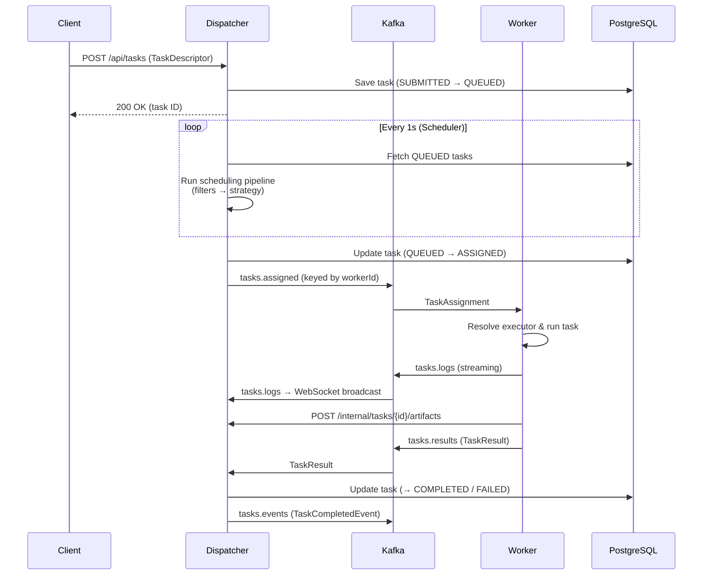
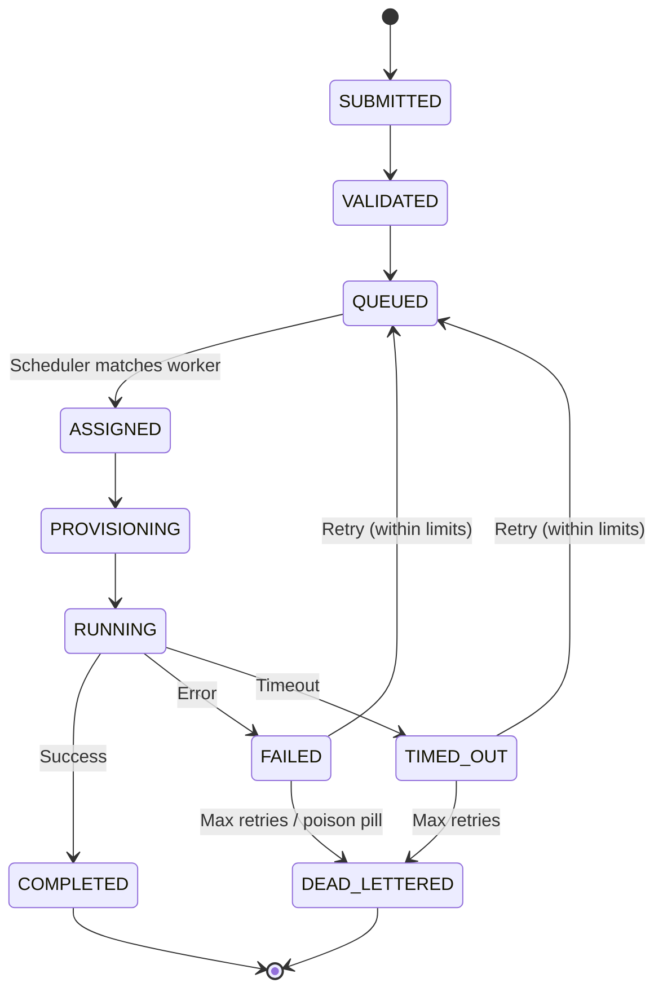
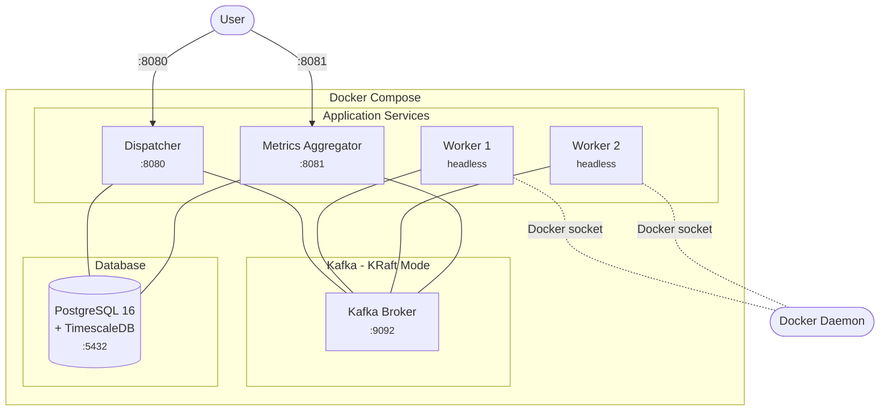
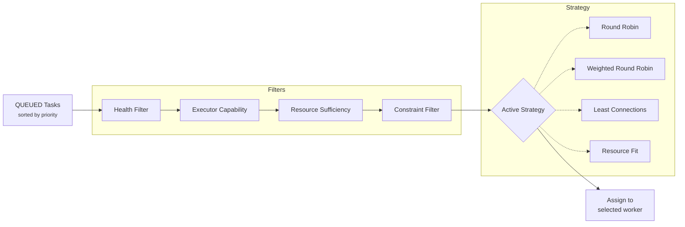
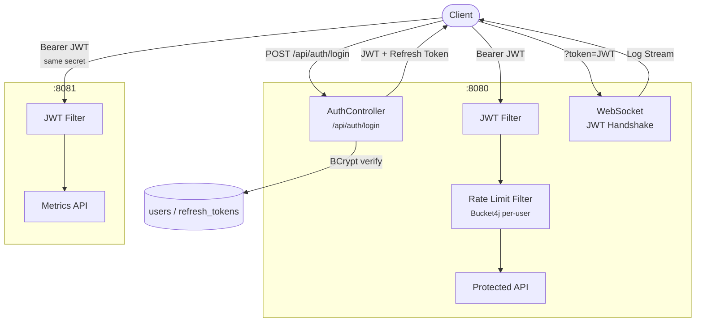
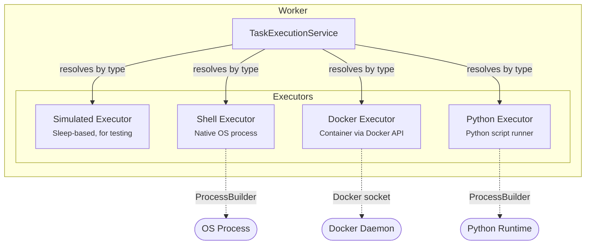

# CloudBalancer Architecture Diagrams

## 1. Bird's Eye View — Services & Infrastructure

The simplest view: what runs, and what connects them.

---

## 2. Component Diagram — Modules & Kafka Topics

Shows the Kafka topic mesh that connects all services.

---

## 3. Task Lifecycle — Sequence Diagram

The journey of a single task from submission to completion.

---

## 4. Task State Machine

All possible states and transitions a task goes through.

---

## 5. Deployment View — Docker Compose

What actually runs when you `docker compose up`.

---

## 6. Scheduling Pipeline Detail

How the dispatcher decides which worker gets a task.

---

## 7. Security & Auth Flow

JWT authentication across all services.

---

## 8. Executor Types

The pluggable execution backends available on each worker.

